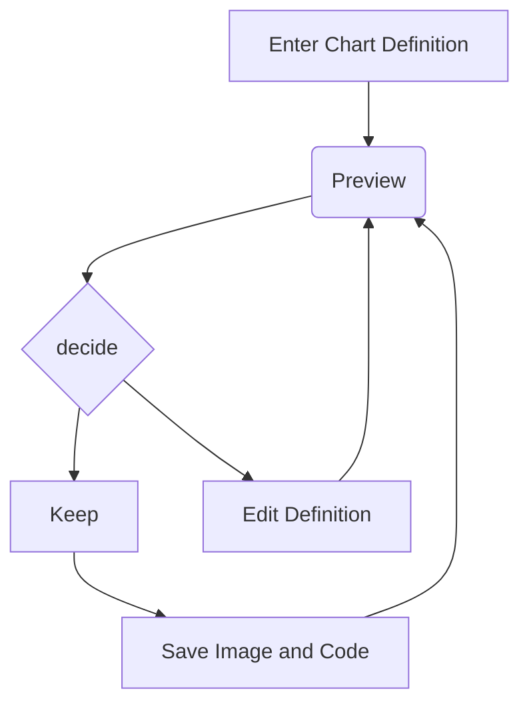

## Getting Started

### 1. Basic Workflow

```mermaid
graph TD
  A[Enter Chart Definition] --> B(Preview)
  B --> C{decide}
  C --> D[Keep]
  C --> E[Edit Definition]
  E --> B
  D --> F[Save Image and Code]
  F --> B
```

> Made with '\u{2665}' (♥) by Jesús Domínguez [@jdomingu19](https://github.com/jdomingu19)
