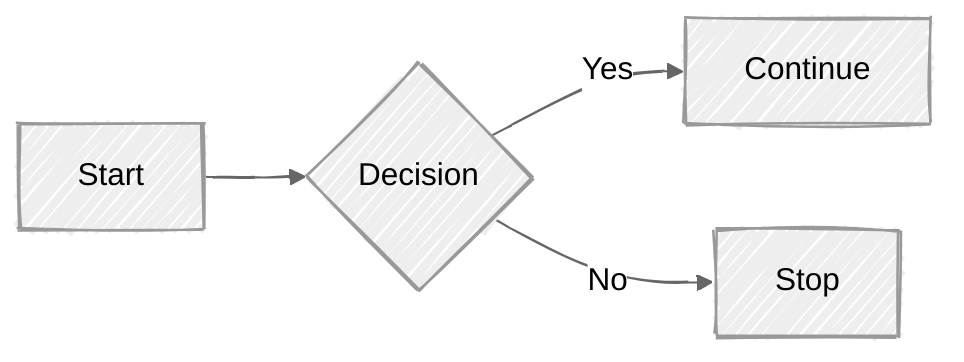

## Syntax and Configuration

### 1. Syntax Structure

### 2. Frontmatter for diagram code

### 3. Selecting Diagram Looks

### 4. Selecting Layout Algorithms

> Made with '\u{2665}' (♥) by Jesús Domínguez [@jdomingu19](https://github.com/jdomingu19)
