## Flowchart Part 2

### 13. A hexagon node

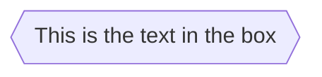

### 14. Parallelogram

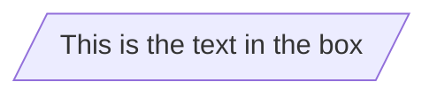

### 15. Parallelogram alt

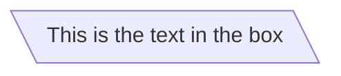

### 16. Trapezoid

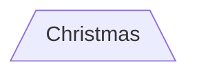

### 17. Trapezoid alt

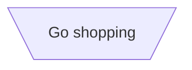

### 18. Double circle

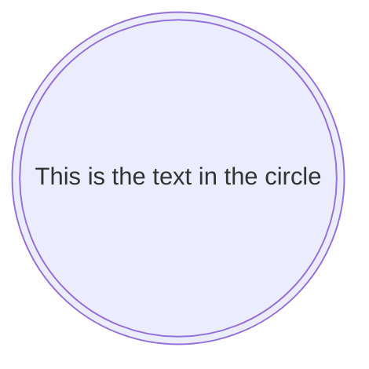

### 19. Example Flowchart with New Shapes

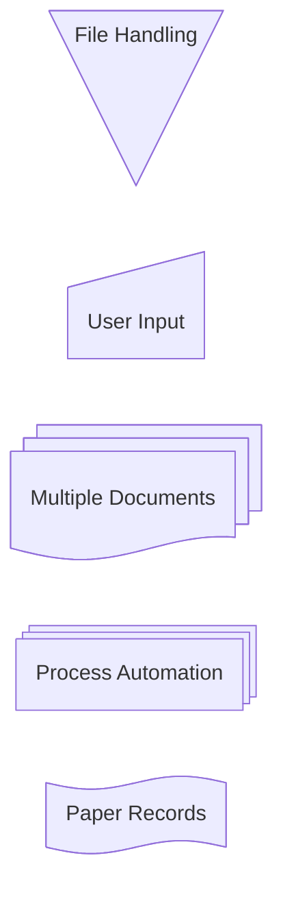

### 20. Process

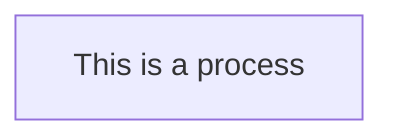

### 21. Event

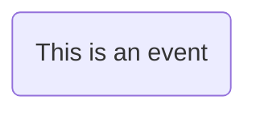

### 22. Terminal Point (Stadium)

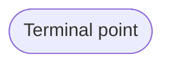

### 23. Subprocess

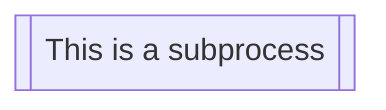

### 24. Database (Cylinder)

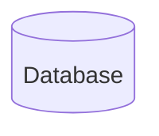

> Made with '\u{2665}' (♥) by Jesús Domínguez [@jdomingu19](https://github.com/jdomingu19)
