## Flowchart Part 5

### 49. Display (Curved Trapezoid)

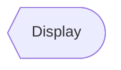

### 50. Divided Process (Divided Rectangle)

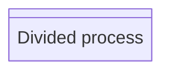

### 51. Extract (Small Triangle)

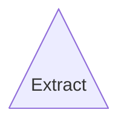

### 52. Internal Storage (Window Pane)

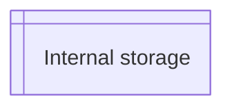

### 53. Junction (Filled Circle)

### 54. Lined Document

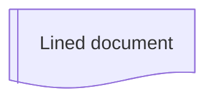

### 55. Loop Limit (Notched Pentagon)

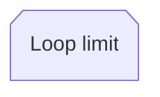

### 56. Manual File (Flipped Triangle)

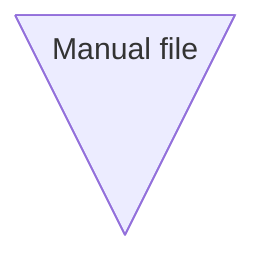

### 57. Manual Input (Sloped Rectangle)

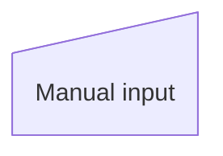

### 58. Multi-Document (Stacked Document)

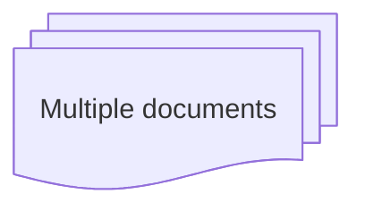

### 59. Multi-Document (Stacked Document)

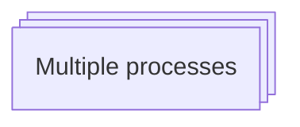

### 60. Paper Tape (Flag)

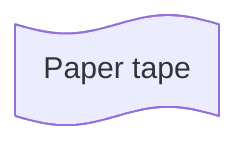

> Made with '\u{2665}' (♥) by Jesús Domínguez [@jdomingu19](https://github.com/jdomingu19)
