## Flowchart Part 1

### 1. A node (default)

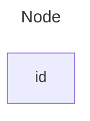

### 2. A node with text

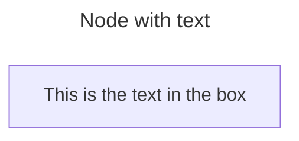

### 3. Unicode text

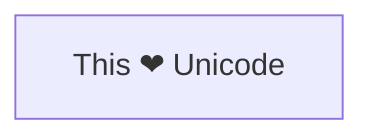

### 4. Markdown formatting

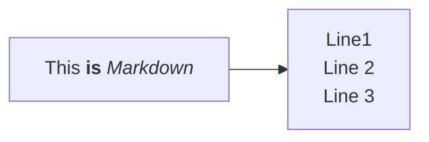

### 5. Direction

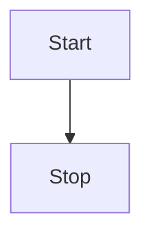

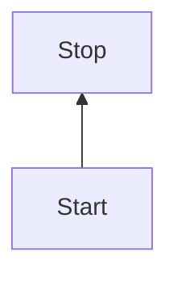

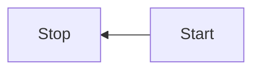

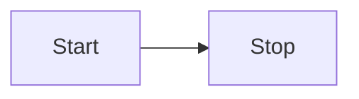

### 6. A node with round edges

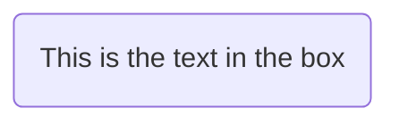

### 7. A stadium-shaped node

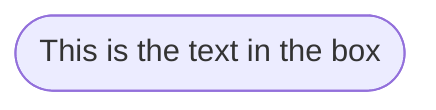

### 8. A node in a subroutine shape

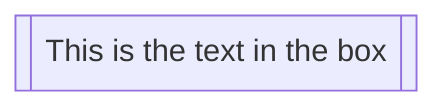

### 9. A node in a cylindrical shape

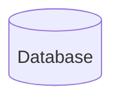

### 10. A node in the form of a circle

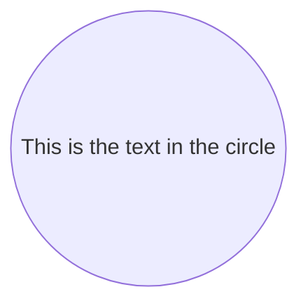

### 11. A node in an asymmetric shape

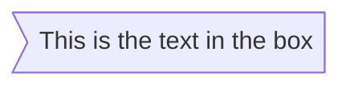

### 12. A node (rhombus)

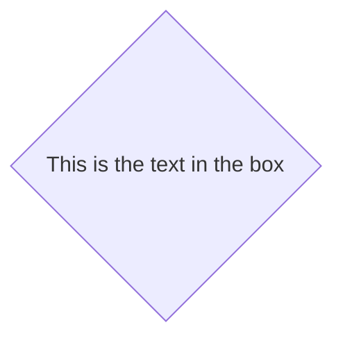
> Made with '\u{2665}' (♥) by Jesús Domínguez [@bluefeatherdev](https://github.com/bluefeatherdev)

