## Flowchart Part 3

### 25. Start (Circle)

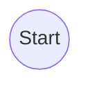

### 26. Odd

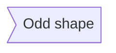

### 27. Decision (Diamond)

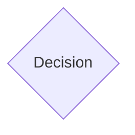

### 28. Prepare Conditional (Hexagon)

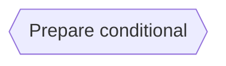

### 29. Data Input/Output (Lean Right)

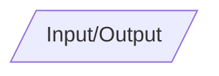

### 30. Data Input/Output (Lean Left)

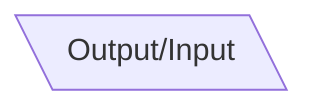

### 31. Priority Action (Trapezoid Base Bottom)

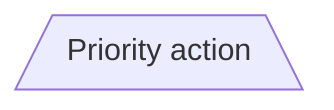

### 32. Manual Operation (Trapezoid Base Top)

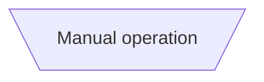

### 33. Manual Operation (Trapezoid Base Top)

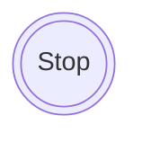

### 34. Text Block

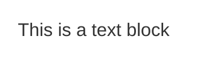

### 35. Card (Notched Rectangle)

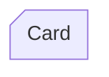

### 36. Lined/Shaded Process

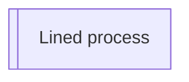

> Made with '\u{2665}' (♥) by Jesús Domínguez [@bluefeatherdev](https://github.com/bluefeatherdev)
