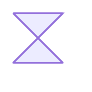

## Flowchart Part 4

### 37. Start (Small Circle)

### 38. Stop (Framed Circle)

### 39. Fork/Join (Long Rectangle)

### 40. Collate (Hourglass)

### 41. Comment (Curly Brace)

### 42. Comment Right (Curly Brace Right)

### 43. Comment with braces on both sides

### 44. Com Link (Lightning Bolt)

### 45. Document

### 46. Delay (Half-Rounded Rectangle)

### 47. Direct Access Storage (Horizontal Cylinder)

### 48. Disk Storage (Lined Cylinder)

> Made with '\u{2665}' (♥) by Jesús Domínguez [@bluefeatherdev](https://github.com/bluefeatherdev)
