## Flowchart Part 6

### 61. Stored Data (Bow Tie Rectangle)

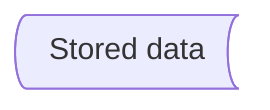

### 62. Summary (Crossed Circle)

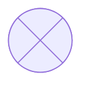

### 63. Tagged Document 

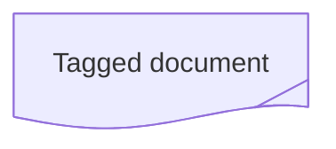

### 64. Tagged Process (Tagged Rectangle)

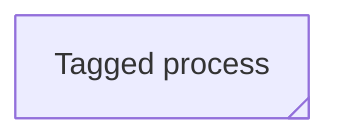

### 65. Icon Shape

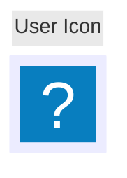

### 66. Image Shape

```mermaid
flowchart TD
  A@{ img: "https://placehold.co/60x60", label: "Image Label", pos: "t", w: 60, h: 60, constraint: "off" }
```

```mermaid
flowchart TD
  %% My image with a constrained aspect ratio
  A@{ img: "https://mermaid.js.org/favicon.svg", label: "My example image label", pos: "t", h: 60, constraint: "on" }
```

### 67. A link with arrow head


### 68. An open link

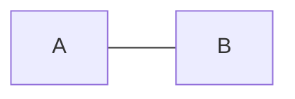

### 69. Text on links

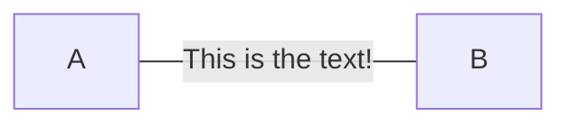

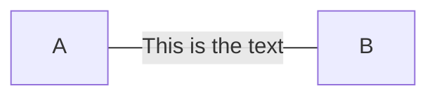

### 70. A link with arrow head and text

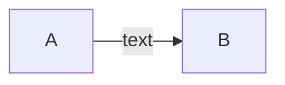


### 71. Dotted link

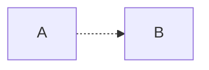

### 72. Dotted link with text

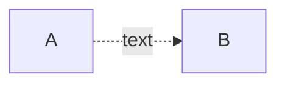

> Made with '\u{2665}' (♥) by Jesús Domínguez [@bluefeatherdev](https://github.com/bluefeatherdev)
