## Flowchart Part 7

### 73. Thick link

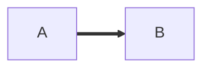

### 74. Thick link with text

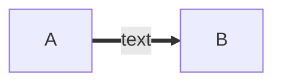

### 75. An invisible link

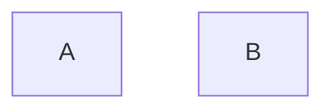

### 76. Chaining of links

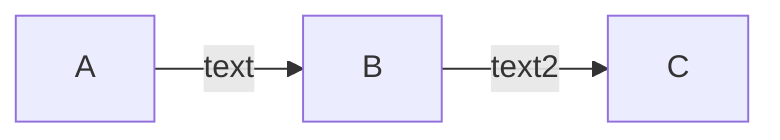

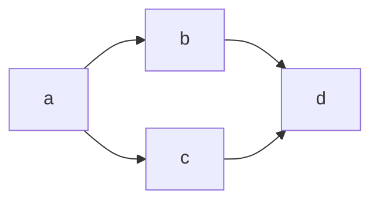

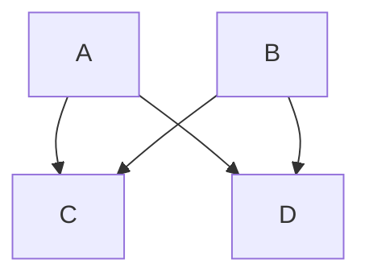

### 77. Attaching an ID to Edges

### 78. Turning an Animation On

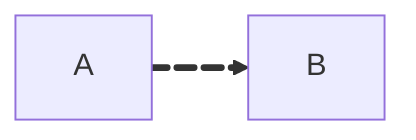

### 79. Selecting Type of Animation

### 80. Using classDef Statements for Animations

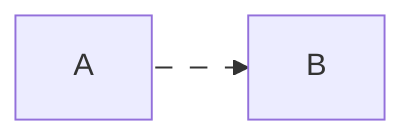

### 81. Circle edge example

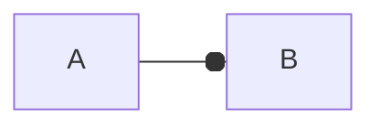

### 82. Circle edge example

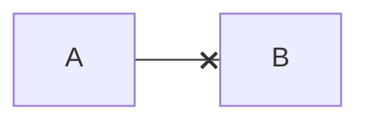

### 83. Multi directional arrows

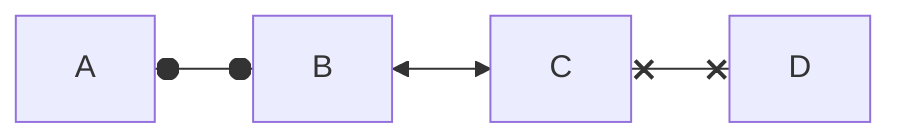

### 84. Minimum length of a link

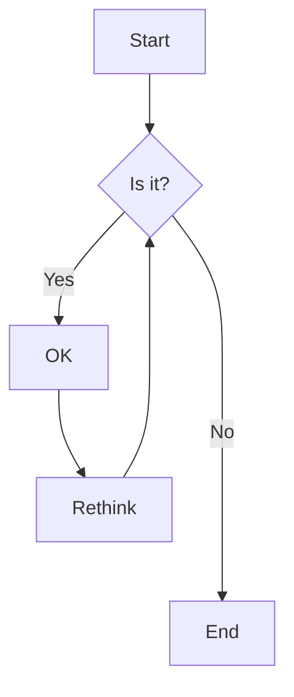

> Made with '\u{2665}' (♥) by Jesús Domínguez [@jdomingu19](https://github.com/jdomingu19)
