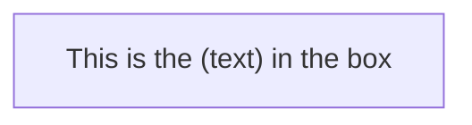
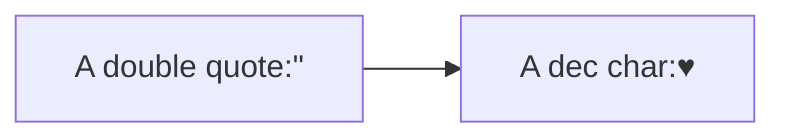

## Flowchart Part 8

### 85. Special characters that break syntax

### 86. Entity codes to escape characters

> Made with '\u{2665}' (♥) by Jesús Domínguez [@bluefeatherdev](https://github.com/bluefeatherdev)
