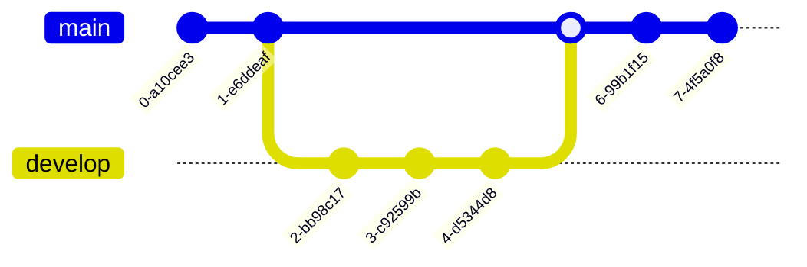

# Hello, Mermaid!

> This repository is licensed under the terms of the [Apache License 2.0](LICENSE).

## Diagram Types

### 1. Flowchart

### 2. Sequence diagram

### 3. Gantt diagram

### 4. Class diagram

### 5. Git Graph

### 6. Entity Relationship Diagram - Experimental

### 7. User Journey Diagram

### 8. Quadrant Chart

### 9. XY Chart

> Made with '\u{2665}' (♥) by Jesús Domínguez [@bluefeatherdev](https://github.com/bluefeatherdev)
