# Hello, Mermaid!


> This repository is licensed under the terms of the [Apache License 2.0](LICENSE).


## Diagram Types

### 1. Flowchart


### 2. Sequence diagram


### 3. Gantt diagram


### 4. Class diagram


### 5. Git Graph

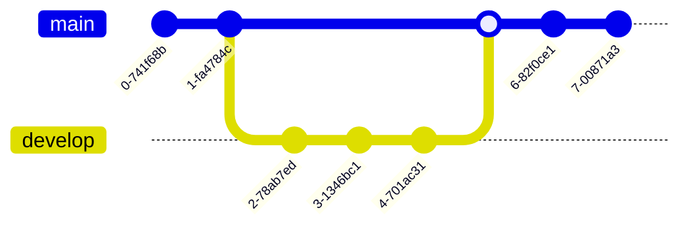

### 6. Entity Relationship Diagram - Experimental


### 7. User Journey Diagram


### 8. Quadrant Chart


### 9. XY Chart


## Getting Started

### 1. Basic Workflow

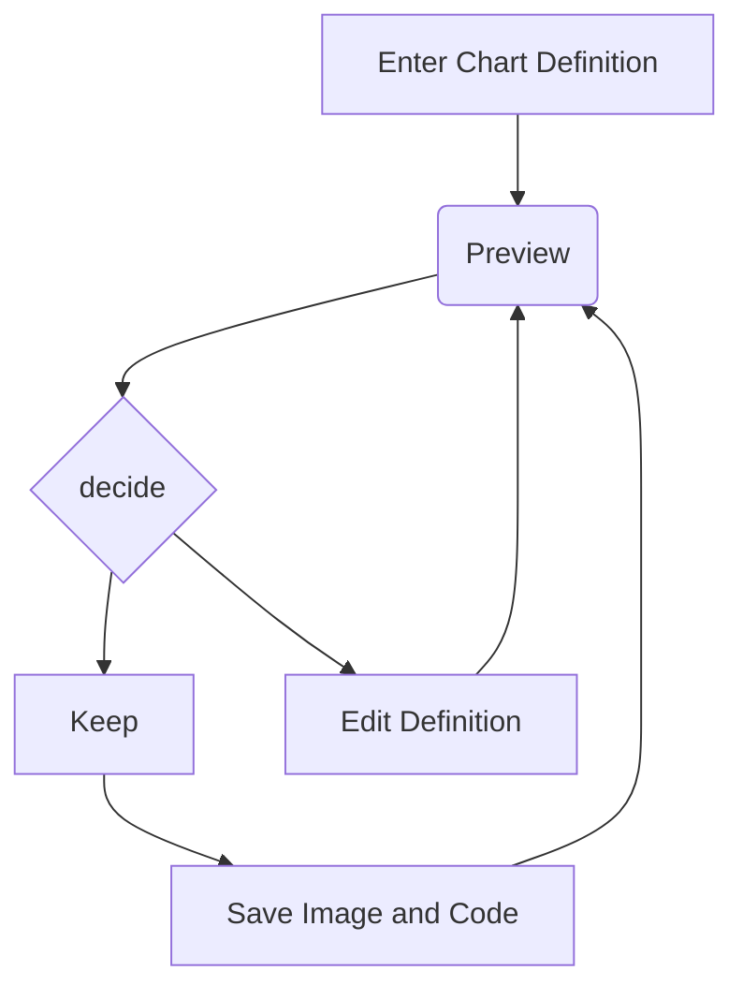

## Syntax and Configuration

### 1. Syntax Structure

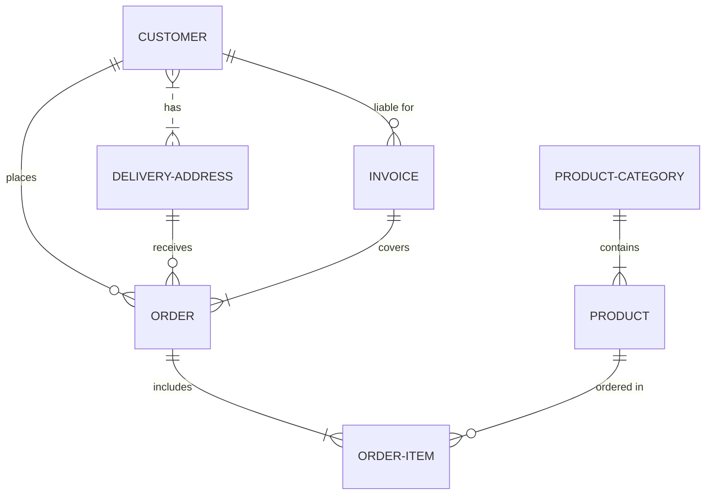

### 2. Frontmatter for diagram code

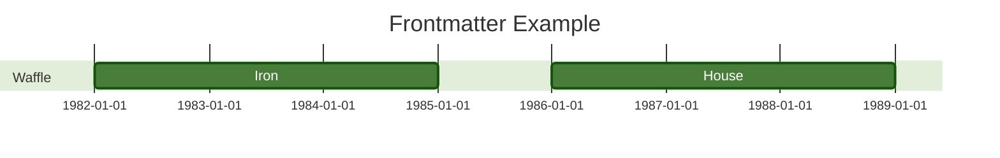

### 3. Selecting Diagram Looks

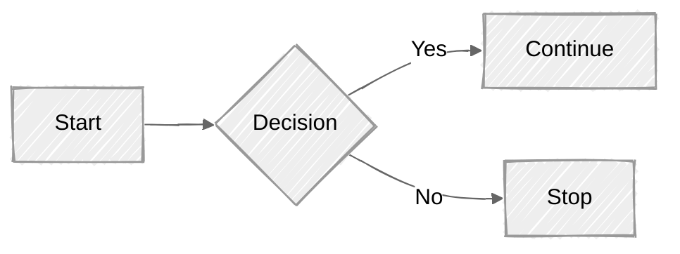

### 4. Selecting Layout Algorithms

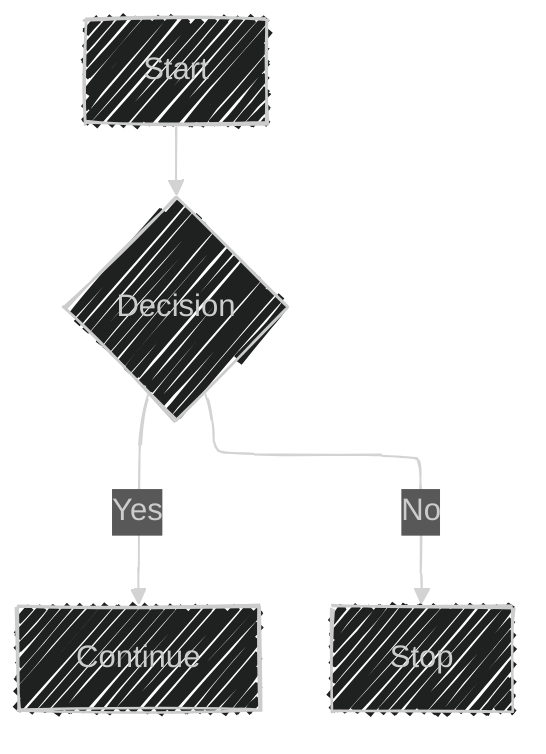

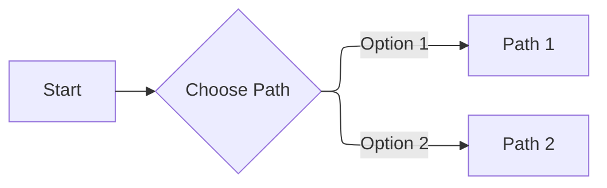

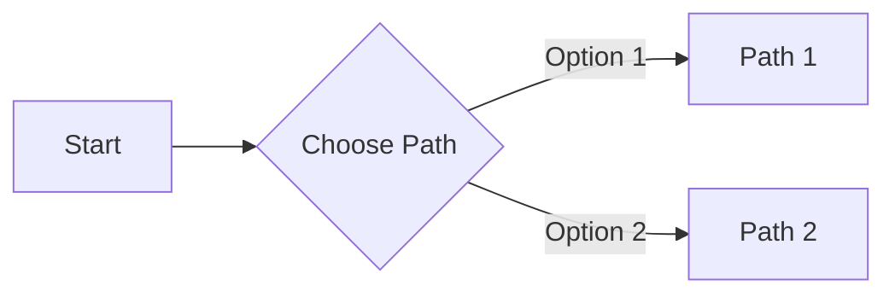

## Flowchart

### 1. A node (default)

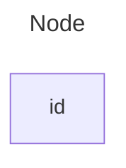

### 2. A node with text

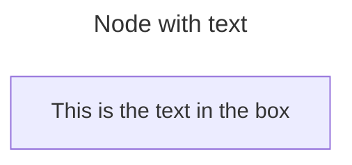

### 3. Unicode text

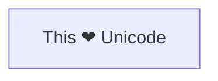

### 4. Markdown formatting

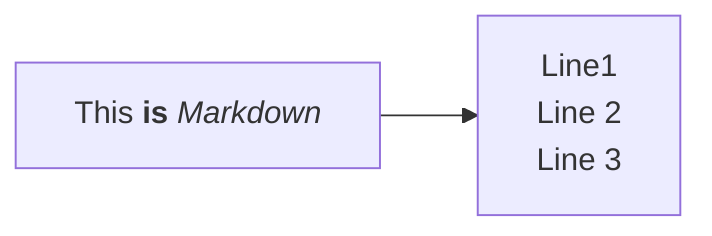

### 5. Direction

```mermaid
flowchart TD
  Start --> Stop
```

```mermaid
flowchart TB
  Start --> Stop
```

```mermaid
flowchart BT
  Start --> Stop
```

```mermaid
flowchart RL
  Start --> Stop
```

```mermaid
flowchart LR
  Start --> Stop
```

### 6. A node with round edges

```mermaid
flowchart LR
  id1(This is the text in the box)
```

### 7. A stadium-shaped node

```mermaid
flowchart LR
  id1([This is the text in the box])
```

### 8. A node in a subroutine shape

```mermaid
flowchart LR
  id1[[This is the text in the box]]
```

### 9. A node in a cylindrical shape

```mermaid
flowchart LR
  id1[(Database)]
```

### 10. A node in the form of a circle

```mermaid
flowchart LR
  id1((This is the text in the circle))
```

### 11. A node in an asymmetric shape

```mermaid
flowchart LR
  id1>This is the text in the box]
```

### 12. A node (rhombus)

```mermaid
flowchart LR
  id1{This is the text in the box}
```

### 13. A hexagon node

```mermaid
flowchart LR
  id1{{This is the text in the box}}
```

### 14. Parallelogram

```mermaid
flowchart TD
  id1[/This is the text in the box/]
```

### 15. Parallelogram alt

```mermaid
flowchart TD
  id1[\This is the text in the box\]
```

### 16. Trapezoid

```mermaid
flowchart TD
  A[/Christmas\]
```

### 17. Trapezoid alt

```mermaid
flowchart TD
  B[\Go shopping/]
```

### 18. Double circle

```mermaid
flowchart TD
  id1(((This is the text in the circle)))
```

### 19. Example Flowchart with New Shapes

```mermaid
flowchart RL
  A@{ shape: manual-file, label: "File Handling"}
  B@{ shape: manual-input, label: "User Input"}
  C@{ shape: docs, label: "Multiple Documents"}
  D@{ shape: procs, label: "Process Automation"}
  E@{ shape: paper-tape, label: "Paper Records"}
```

### 20. Process

```mermaid
flowchart TD
  A@{ shape: rect, label: "This is a process" }
```

### 21. Event

```mermaid
flowchart TD
    A@{ shape: rounded, label: "This is an event" }
```

### 22. Terminal Point (Stadium)

```mermaid
flowchart TD
  A@{ shape: stadium, label: "Terminal point" }
```

### 23. Subprocess

```mermaid
flowchart TD
  A@{ shape: subproc, label: "This is a subprocess" }
```

### 24. Database (Cylinder)

```mermaid
flowchart TD
  A@{ shape: cyl, label: "Database" }
```

### 25. Start (Circle)

```mermaid
flowchart TD
  A@{ shape: circle, label: "Start" }
```

### 26. Odd

```mermaid
flowchart TD
  A@{ shape: odd, label: "Odd shape" }
```

### 27. Decision (Diamond)

```mermaid
flowchart TD
  A@{ shape: diamond, label: "Decision" }
```

### 28. Prepare Conditional (Hexagon)

```mermaid
flowchart TD
  A@{ shape: hex, label: "Prepare conditional" }
```

### 29. Data Input/Output (Lean Right)

```mermaid
flowchart TD
  A@{ shape: lean-r, label: "Input/Output" }
```

### 30. Data Input/Output (Lean Left)

```mermaid
flowchart TD
  A@{ shape: lean-l, label: "Output/Input" }
```

### 31. Priority Action (Trapezoid Base Bottom)

```mermaid
flowchart TD
  A@{ shape: trap-b, label: "Priority action" }
```

### 32. Manual Operation (Trapezoid Base Top)

```mermaid
flowchart TD
  A@{ shape: trap-t, label: "Manual operation" }
```

### 33. Manual Operation (Trapezoid Base Top)

```mermaid
flowchart TD
  A@{ shape: dbl-circ, label: "Stop" }
```

### 34. Text Block

```mermaid
flowchart TD
  A@{ shape: text, label: "This is a text block" }
```

### 35. Card (Notched Rectangle)

```mermaid
flowchart TD
  A@{ shape: notch-rect, label: "Card" }
```

### 36. Lined/Shaded Process

```mermaid
flowchart TD
  A@{ shape: lin-rect, label: "Lined process" }
```

### 37. Start (Small Circle)

```mermaid
flowchart TD
  A@{ shape: sm-circ, label: "Small start" }
```

### 38. Stop (Framed Circle)

```mermaid
flowchart TD
  A@{ shape: framed-circle, label: "Stop" }
```

### 39. Fork/Join (Long Rectangle)

```mermaid
flowchart TD
  A@{ shape: fork, label: "Fork or Join" }
```

### 40. Collate (Hourglass)

```mermaid
flowchart TD
  A@{ shape: hourglass, label: "Collate" }
```

### 41. Comment (Curly Brace)

```mermaid
flowchart TD
  A@{ shape: comment, label: "Comment" }
```

### 42. Comment Right (Curly Brace Right)

```mermaid
flowchart TD
  A@{ shape: brace-r, label: "Comment" }
```

### 43. Comment with braces on both sides

```mermaid
flowchart TD
  A@{ shape: braces, label: "Comment" }
```

### 44. Com Link (Lightning Bolt)

```mermaid
flowchart TD
  A@{ shape: bolt, label: "Communication link" }
```

### 45. Document

```mermaid
flowchart TD
  A@{ shape: doc, label: "Document" }
```

### 46. Delay (Half-Rounded Rectangle)

```mermaid
flowchart TD
  A@{ shape: delay, label: "Delay" }
```

### 47. Direct Access Storage (Horizontal Cylinder)

```mermaid
flowchart TD
  A@{ shape: das, label: "Direct access storage" }
```

### 48. Disk Storage (Lined Cylinder)

```mermaid
flowchart TD
  A@{ shape: lin-cyl, label: "Disk storage" }
```

### 49. Display (Curved Trapezoid)

```mermaid
flowchart TD
  A@{ shape: curv-trap, label: "Display" }
```

### 50. Divided Process (Divided Rectangle)

```mermaid
flowchart TD
  A@{ shape: div-rect, label: "Divided process" }
```

### 51. Extract (Small Triangle)

```mermaid
flowchart TD
  A@{ shape: tri, label: "Extract" }
```

### 52. Internal Storage (Window Pane)

```mermaid
flowchart TD
  A@{ shape: win-pane, label: "Internal storage" }
```

### 53. Junction (Filled Circle)

```mermaid
flowchart TD
  A@{ shape: f-circ, label: "Junction" }
```

### 54. Lined Document

```mermaid
flowchart TD
  A@{ shape: lin-doc, label: "Lined document" }
```

### 55. Loop Limit (Notched Pentagon)

```mermaid
flowchart TD
  A@{ shape: notch-pent, label: "Loop limit" }
```

### 56. Manual File (Flipped Triangle)

```mermaid
flowchart TD
  A@{ shape: flip-tri, label: "Manual file" }
```

### 57. Manual Input (Sloped Rectangle) 

```mermaid
flowchart TD
  A@{ shape: sl-rect, label: "Manual input" }
```

### 58. Multi-Document (Stacked Document)

```mermaid
flowchart TD
  A@{ shape: docs, label: "Multiple documents" }
```

### 59. Multi-Document (Stacked Document)

```mermaid
flowchart TD
  A@{ shape: processes, label: "Multiple processes" }
```

### 60. Paper Tape (Flag)

```mermaid
flowchart TD
  A@{ shape: flag, label: "Paper tape" }
```

### 61. Stored Data (Bow Tie Rectangle)

```mermaid
flowchart TD
  A@{ shape: bow-rect, label: "Stored data" }
```

### 62. Summary (Crossed Circle)

```mermaid
flowchart TD
  A@{ shape: cross-circ, label: "Summary" }
```

### 63. Tagged Document 

```mermaid
flowchart TD
  A@{ shape: tag-doc, label: "Tagged document" }
```

### 64. Tagged Process (Tagged Rectangle)

```mermaid
flowchart TD
  A@{ shape: tag-rect, label: "Tagged process" }
```


> Made with '\u{2665}' (♥) by Jesús Domínguez [@bluefeatherdev](https://github.com/bluefeatherdev)
